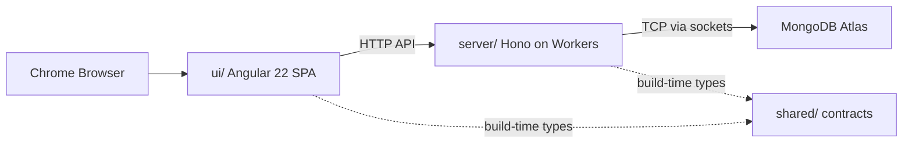
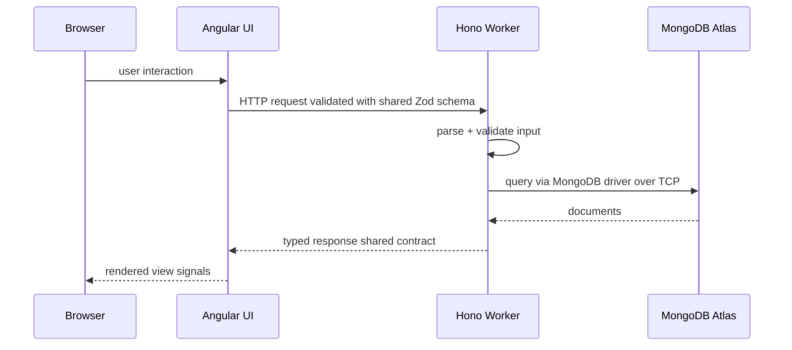

# Architecture

> Single source of truth for the system architecture. Any change here MUST be accompanied by an entry in
> [`decisions.md`](decisions.md).
>
> Operational rules for agents (TypeScript standards, linting, testing, shared contracts) live in
> [`AGENTS.md`](../AGENTS.md). Package-specific guides live in [`ui/AGENTS.md`](../ui/AGENTS.md) and
> [`server/AGENTS.md`](../server/AGENTS.md).

---

## Overview

A greenfield educational full-stack application built to learn modern development practices, AI-assisted workflows, and
multi-agent software development.

The system is a monorepo with three packages that share contracts:



- **Latest stable Chrome only.** No legacy browser support required.
- **Zoneless Angular** with Signals as the sole state management primitive.
- **Edge-deployed backend** on Cloudflare Workers connecting to MongoDB Atlas over TCP via `cloudflare:sockets` with
  `nodejs_compat`.

---

## Monorepo Structure

```
application/
├── docs/          architecture, decisions, tasks, components
├── shared/        API contracts, Zod schemas, shared types
├── ui/            Angular 22 frontend (Cloudflare Pages)
└── server/        Hono backend (Cloudflare Workers)
```

Managed with **npm workspaces**. The `shared` package is consumed by both `ui` and `server` as a local workspace
dependency, eliminating duplicated DTOs.

---

## Frontend — `ui/`

| Concern          | Choice                                  |
| ---------------- | --------------------------------------- |
| Framework        | Angular 22                              |
| Language         | TypeScript (strict)                     |
| UI Library       | PrimeNG                                 |
| Styling          | SCSS                                    |
| State            | Angular Signals                         |
| Forms            | Signal Forms                            |
| Inputs/Queries   | Signal Inputs, Signal Queries           |
| Data Fetching    | `httpResource`                          |
| Template Syntax  | Control Flow (`@if`, `@for`, `@switch`) |
| Lazy Loading     | Deferrable Views (`@defer`)             |
| Change Detection | Zoneless                                |

### Forbidden in the frontend

- NgModules
- NgRx
- Template-driven Forms
- RxJS as state management (RxJS is fine for interop, not as a store)
- Tailwind CSS

> See [`ui/AGENTS.md`](../ui/AGENTS.md) for the full list (including `@HostBinding`/`@HostListener`, explicit
> `standalone: true`, etc.).

### Deployment

Static build deployed to **Cloudflare Pages**.

---

## Backend — `server/`

| Concern       | Choice                                      |
| ------------- | ------------------------------------------- |
| Runtime       | Cloudflare Workers (V8 isolates)            |
| Framework     | Hono                                        |
| Language      | TypeScript (strict)                         |
| Database      | MongoDB Atlas                               |
| Driver        | Official MongoDB Node Driver                |
| Validation    | Zod (schemas shared from `shared/`)         |
| Compatibility | `nodejs_compat` flag + `cloudflare:sockets` |

### Architecture Rules

- Business logic MUST NOT live inside route handlers.
- Use a simple service-oriented architecture: routes → services → data access.
- Reuse Zod schemas and types from `shared/` — never redefine DTOs.
- Route handlers are thin: parse/validate input, call a service, return a response.

### MongoDB on Workers

The official MongoDB driver connects over TCP. Cloudflare Workers expose TCP via the `cloudflare:sockets` API and
Node.js compatibility via the `nodejs_compat` compatibility flag. The driver is configured with a custom connection
option that routes TCP through `cloudflare:sockets`.

> See ADR-0002 in [`decisions.md`](decisions.md) for the rationale and fallback strategy.

### Forbidden in the backend

- NestJS
- Mongoose
- Prisma
- Express / Fastify (Hono is the only HTTP framework)

> See [`server/AGENTS.md`](../server/AGENTS.md) for the full list.

---

## Shared Package — `shared/`

Contains the contract layer reused by both frontend and backend:

- **`contracts/`** — API request/response shapes, route definitions.
- **`validation/`** — Zod schemas (the single source of validation truth).
- **`types/`** — TypeScript types inferred from Zod schemas (`z.infer`).

Principle: define a schema once in `shared/validation`, infer types from it, and import on both sides. Never hand-write
a DTO type that duplicates a Zod schema.

---

## Data Flow



---

## Testing Strategy

| Layer    | Tool                 | Scope                                   |
| -------- | -------------------- | --------------------------------------- |
| Frontend | Vitest (`*.spec.ts`) | Unit tests for components, services     |
| Frontend | Playwright           | End-to-end browser tests                |
| Backend  | Vitest (`*.test.ts`) | Unit tests for services, route handlers |
| Shared   | Vitest (`*.test.ts`) | Schema validation tests                 |

All important business logic must be testable. Services are pure and dependency-injectable so they can be tested without
a live database.

---

## Code Quality

Code quality standards (TypeScript strict mode, no `any`, ESLint + Prettier, Conventional Commits, Vitest) are defined
in [`AGENTS.md`](../AGENTS.md) under **Shared Standards** and are not repeated here.

---

## Infrastructure

| Concern     | Platform           |
| ----------- | ------------------ |
| Source      | GitHub             |
| CI          | GitHub Actions     |
| Frontend CD | Cloudflare Pages   |
| Backend CD  | Cloudflare Workers |
| Database    | MongoDB Atlas      |

### CI Pipeline

```
lint → typecheck → unit tests → build
```

### CD Pipeline

Deploy automatically after a successful CI run on the main branch.

---

## Architectural Principles

1. **Simplicity first.** Prefer the simplest solution that scales reasonably.
2. **Single source of truth.** One schema → inferred types → reused everywhere.
3. **Thin edges, rich services.** Handlers validate and delegate; logic lives in services.
4. **No premature abstraction.** Add patterns only when the need is concrete.
5. **Long-term maintainability.** Every decision is recorded and reversible.
