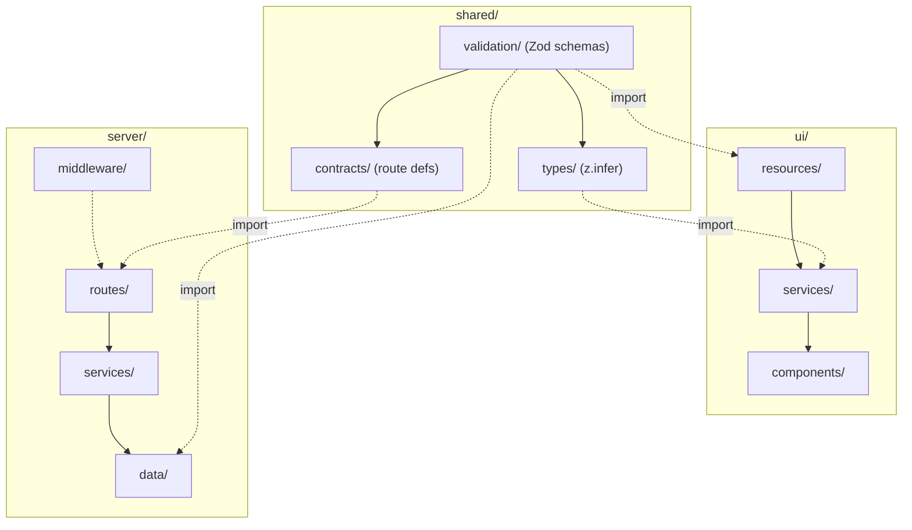

# Components

> Component boundaries, dependencies, and ownership. For the system-level architecture and data-flow diagrams, see
> [`architecture.md`](architecture.md). For operational rules, see the [`AGENTS.md`](../AGENTS.md) files.

---

## Dependency Map

Solid arrows = runtime calls. Dashed arrows = build-time type/schema imports.

---

## `shared/` — Contract Layer

| Component     | Exposes                                   | Depends on              | Boundary                               |
| ------------- | ----------------------------------------- | ----------------------- | -------------------------------------- |
| `validation/` | Zod schemas                               | Zod only                | No runtime logic, no framework code    |
| `types/`      | `z.infer` types                           | `validation/`           | Types only — never hand-written DTOs   |
| `contracts/`  | Route definitions (method, path, schemas) | `validation/`, `types/` | API shape contracts, no implementation |

> Rules: [`shared/AGENTS.md`](../shared/AGENTS.md)

---

## `ui/` — Frontend SPA

| Component     | Exposes                              | Depends on                          | Boundary                                    |
| ------------- | ------------------------------------ | ----------------------------------- | ------------------------------------------- |
| `components/` | Standalone components (`<name>.ts`)  | `services/` (signals)               | No direct API calls; consume signals        |
| `services/`   | Signal-based state, mutation methods | `@app/shared` types, `resources/`   | Owns state; no template logic               |
| `resources/`  | `httpResource` wrappers              | `@app/shared` schemas, `HttpClient` | Validates responses with shared Zod schemas |

**Dependency direction:** `components → services → resources → shared contracts`

> Rules: [`ui/AGENTS.md`](../ui/AGENTS.md)

---

## `server/` — Backend Worker

| Component     | Exposes                          | Depends on                               | Boundary                            |
| ------------- | -------------------------------- | ---------------------------------------- | ----------------------------------- |
| `routes/`     | HTTP endpoints                   | Hono, `@app/shared` schemas, `services/` | Thin — validate, delegate, respond  |
| `services/`   | Business logic methods           | `DataStore` interface                    | No Hono, no MongoDB driver          |
| `data/`       | `DataStore` / `DataStoreFactory` | MongoDB driver, `cloudflare:sockets`     | Only place that knows about sockets |
| `middleware/` | Error handler, CORS, logger      | Hono Context                             | Cross-cutting; no business logic    |

**Dependency direction:** `routes → services → data (DataStore interface)`

The `data/` layer is the **only** component that imports `mongodb` or `cloudflare:sockets`. This isolates the ADR-0002
fallback (swap to Atlas Data API) to a single component.

> Rules: [`server/AGENTS.md`](../server/AGENTS.md)

---

## Cross-Cutting

| Concern    | Owner                                          | Notes                                                      |
| ---------- | ---------------------------------------------- | ---------------------------------------------------------- |
| CI/CD      | GitHub Actions                                 | `lint → typecheck → test → build`; deploy on `main`        |
| Linting    | Root [`eslint.config.js`](../eslint.config.js) | Package-specific overrides in each package                 |
| Testing    | Vitest (all), Playwright (ui E2E)              | See [`AGENTS.md`](../AGENTS.md) Testing section            |
| Env config | `server/env.ts`, `server/wrangler.toml`        | Secrets via `wrangler secret put`; vars in `wrangler.toml` |
